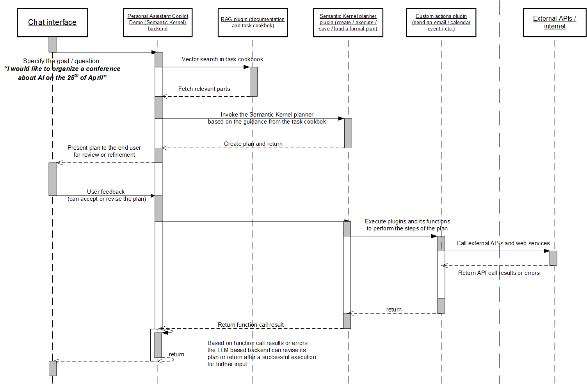

# Process Expert Copilot - Using Microsoft Semantic Kernel

This console application demonstrates how to use the [Microsoft Semantic Kernel SDK](https://github.com/microsoft/semantic-kernel/) using OpenAI LLMs, like GPT4, and leveraging the main features of the framework: RAG for long term memory, planning, function calling, etc.


## Technical realization

- Uses Semantic Kernel SDK (currently, the C# SDK, as that is the most well supported and advanced version -- eventually try to port this to the Python SDK if that catches up with the C# version)

## Prerequisites

- [.NET 8](https://dotnet.microsoft.com/download/dotnet/8.0) is required to run this application.
- Install the recommended extensions
  - [C#, VS](https://marketplace.visualstudio.com/items?itemName=ms-dotnettools.csharp)
  - [C#, VS Code](https://marketplace.visualstudio.com/items?itemName=ms-dotnettools.csdevkit)

## Setting up the application

The starter can be configured by using either:

1. Rename the file [ConfigurationSettings.cs.template] to [ConfigurationSettings.cs]
1. Edit the file to add your Azure OpenAI endpoint configuration and the SAP backend info

```
using Microsoft.Extensions.Logging;
public class ConfigurationSettings
{
	public const string ServiceType = "OpenAI"; 						// AzureOpenAI or OpenAI
    public const string ApiKey = "sk-xxxx"; 							// OpenAI API key
	public const string ModelId = "gpt-4"; 								// Only for OpenAI ServiceType
	public const string EmbeddingModelId = "text-embedding-ada-002"; 	// Only for OpenAI ServiceType
	public const string DeploymentId = "xxxxxxx"; 						// Only for AzureOpenAI ServiceType
	public const string EmbeddingDeploymentId = "xxxxx"; 				// Only for AzureOpenAI ServiceType
	public const string Endpoint = "https://xxxxx.openai.azure.com/";	// Only for AzureOpenAI ServiceType

	public const string BingAiSearchApiKey = "xxxxxx";
	public const string GmailEmailUsername = "xxxxxx@gmail.com";
	public const string GmailEmailAppPassword = "xxxxxxx";	
	public const string GmailEmailSender = "John Doe";
	public const LogLevel LogLevelValue = LogLevel.Warning;
}
```

### Required packages

Can be found in SemanticKernelConsoleCopilotDemo.csproj, these packages with these versions should be installed. 
For this, you can run

```dotnet restore```

### Enabling better formatting for the Windows command prompt console (optional)

For cmd.exe, the following steps are required to enable Unicode support (and thus better formatting).

1. Run intl.cpl
1. Click the Administrative tab
1. Click the Change system locale button
1. Check the "Use Unicode UTF-8 for worldwide language support" checkbox
1. Reboot

## Running the console app

To run the console application just hit `F5`.

To build and run the application from the terminal use the following commands:

```bash
dotnet run
```

## Script and prompts you can try

The following prompts can be checked to test the demo functionalities:
- What are large language models? *(will do a RAG search)*
- I would like to organize a conference *(will invoke the planner, but ask for the parameters first)*
- I would like to organize a conference on the 25th of April, topic is about the uses of AI in log analysis and about AI avatars. The particpants are: Bence - bogusmail@mail.com, Máté - bogusmail2@mail.com, Liza - bogusmail3@gmail.com *(will invoke the planner)*
- Save a plan *(in case it was already generated)*
- Load a plan *(in case it was already saved)*
- Can you visualize the plan in a flow chart? *(will generate a [Mermaid Chart](https://mermaid.js.org/syntax/flowchart.html))*
- What can you do? *(will list all plugin functions)*

# Using the POC as a starting point for your own use case

## Namespaces and project settings

1. This example puts every class in the SemanticKernelConsoleCopilotDemo namespace, which should be renamed
1. In the [project settings](SemanticKernelConsoleCopilotDemo.csproj) and other related files, change the things which are needed.

You should essentially be doing a project name replacement: https://www.linkedin.com/pulse/how-rename-solution-project-visual-studio-/

## Classes to adjust for your own use case

#### Current implementation



#### [plugins/DocuRAGPlugin.cs](plugins/DocuRAGPlugin.cs)
- Rename the methods RetrieveRagContent and GetProcessGuidance according to your own use case (if needed)
- Revise the Description and parameter decorators 
- Adjust InitKernelMemoryForRAG to import your own documents
- Via the AddTag SK method, we can "split" the documents into various topics, and only use some of the documents in certain cases (see how the planner only gets guidance from one of the RAG sources in GetProcessGuidance and how the RetrieveRagContent uses the other)

#### [plugins/PlannerPlugin.cs](plugins/PlannerPlugin.cs)
- This class contains the SK Planner plan creator and invocation, via methods CreateProcessPlan and ExecuteProcessPlan
- See system prompt in Program.cs to see how these two methods work
- Adjust and rename these methods to your own use case, as well as the decorators
- GenerateChartForPlan: This an experimental plugin function that converts the plan from the planner to [Mermaid Chart](https://mermaid.js.org/syntax/flowchart.html) format and shows a link to an online tool where the plan can be displayed
- The planner plugin can also save and reload plans

#### [plugins/CustomActionsPlugin.cs](plugins/CustomActionsPlugin.cs)
- This the main Plugin that contains the building blocks that e.g. the planner can use, in this case: e-mail sending and adding calendar event (with dummy implementation)
- You can implement your own Plugins in similar way (see [SK documentation](https://learn.microsoft.com/en-us/semantic-kernel/agents/plugins/?tabs=Csharp))

#### [utils/FunctionFilters.cs](utils/FunctionFilters.cs)
- Filters in SK can be used to add hooks before and after functions area called
- Here I have a function specific override in OnFunctionInvoked, that shows a file selector in the console if the GetPlansList is called (you can do similar things to better format the output of certain function calls)
- The other OnFunctionInvoking method is about showing the function call invocation context

#### [Program.cs](Program.cs)
- The method InitPlugins instantiates the plugins, e.g. your own
- ChatModelPromptExecutionSettings contains the system prompt for the assistant, it needs to be adjusted
- WriteIntroToConsole writes the intro message, what the actual tool does that you implement
- InitKernel sets the SK function filter (see above)
- Note that the ProcessExpertSystemPrompt contains sometimes references to specific functions in plugins, in order to better guide the model how to "behave" in certain situations, e.g. to clarify missing parameters, etc.